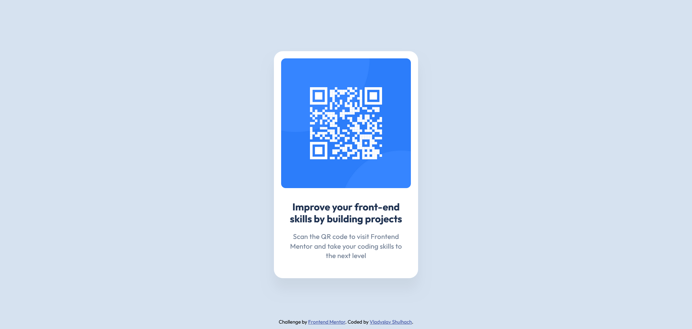

# Frontend Mentor - QR code component solution

This repository contains my solution to the [QR code component challenge on Frontend Mentor](https://www.frontendmentor.io/challenges/qr-code-component-iux_sIO_H), demonstrating my approach to the task.

## Table of contents

- [Overview](#overview)
  - [Screenshot](#screenshot)
  - [Links](#links)
- [My process](#my-process)
  - [Built with](#built-with)
  - [What I learned](#what-i-learned)
- [Author](#author)

## Overview

### Screenshot

This screenshot showcases the final design, demonstrating how closely the code aligns with the intended visual layout.

### Links

- Solution URL: [My solution URL here](https://www.frontendmentor.io/solutions/qr-code-component-solution-using-html-and-css-_kFF9aDrOg)
- Live Site URL: [My live site URL here](https://vladyslav-shulhach.github.io/qr-code-component-main/)

## My process

### Built With
- **Semantic HTML5**
- **CSS**
- **Flexbox**

### What I Learned
During this project, I learned to accurately translate a design into HTML and CSS. Using Flexbox allowed me to position and align elements with precision, making the design responsive and visually consistent.

## Author

- Frontend Mentor - [Vladyslav Shulhach](https://www.frontendmentor.io/profile/Vladyslav-Shulhach)
